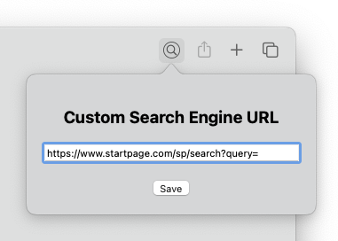

-----

Safari Web Extension to customize your search engine.

Search queries made from the Safari address bar are appended to the custom search engine URL.

**Note:** The extension does not affect Safari search engine suggestions. In case of privacy concerns, it is advised to set the default search engine to DuckDuckGo and to disable search engine suggestions.

||
|:--:| 
| *Custom Search Extension Settings* |

# Technical details
* Safari default search engine queries are matched on a best-effort basis
* Declarative Net Requests are utilized to block queries to the default search engines
* WebNavigation is used to redirect search queries to the custom search engine

# Known issues
* There is a Safari bug where, if a blocked link is the last opened page, it may evade blocking when resuming the browser